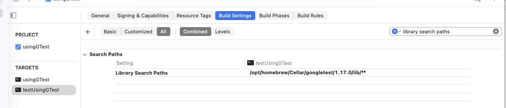
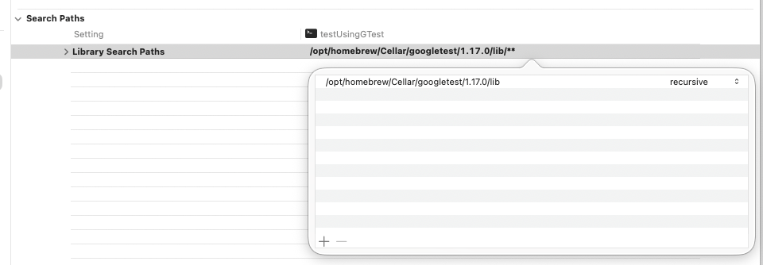
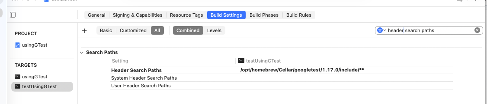
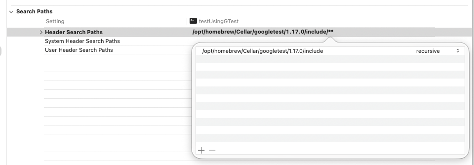
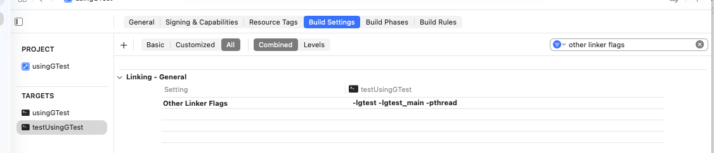
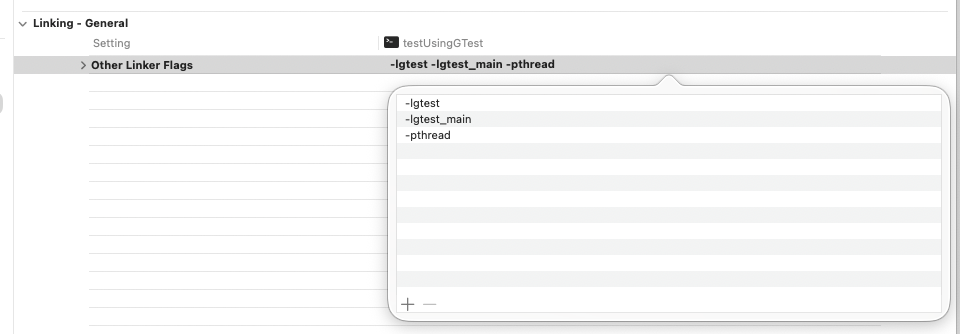
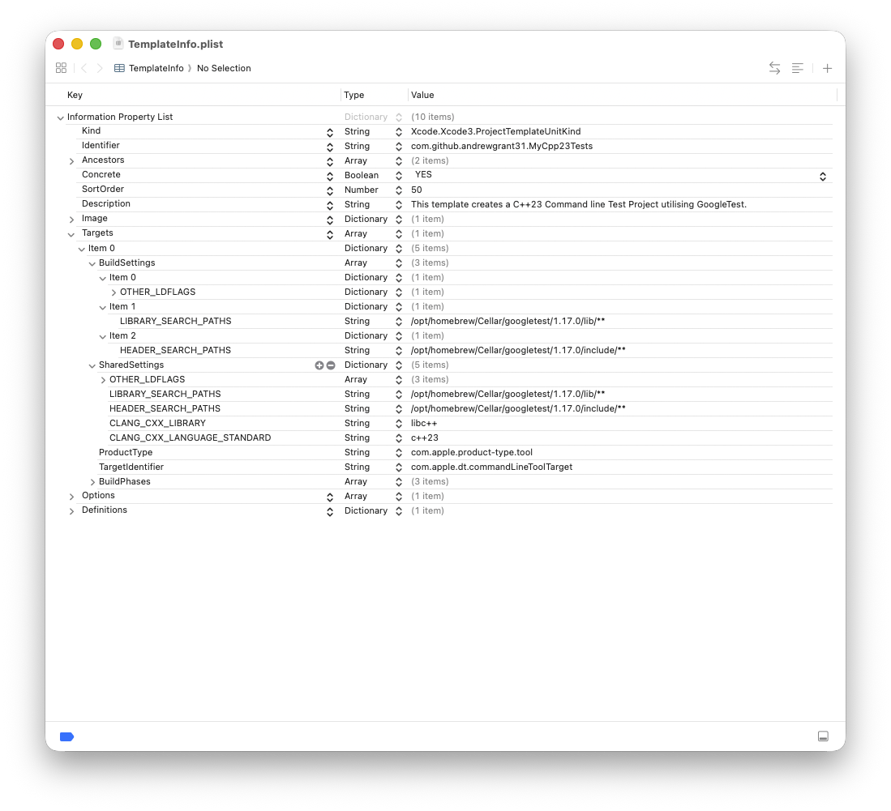
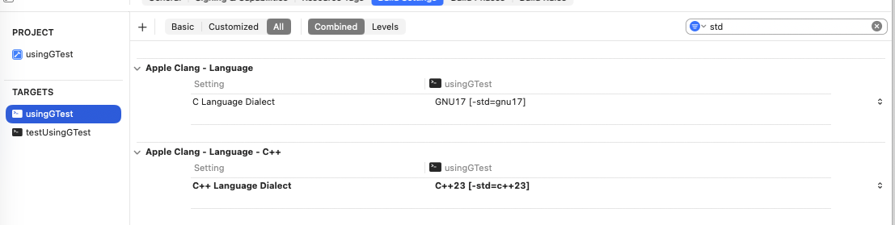
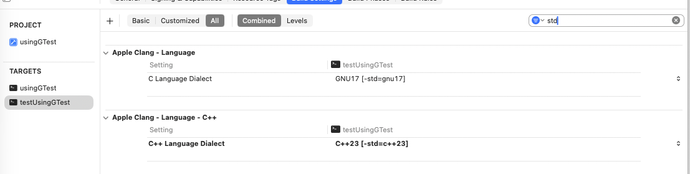

# XCode_Cpp_Templates
A set of templates for developing and using C++ in XCode (c++ standard 23) with GoogleTest being made available

## First things first:  
Pop the **IDETemplateMacros.plist** file into:  
**~/Library/Developer/Xcode/UserData**   
Unless you already have a file with the identifier **_IDETemplateMacros.plist_**.  
If so, copy the following into the existing **_IDETemplateMacros.plist_**  
   ```xml
    <dict>  
        <key>TEST</key>  
        <string>Test</string>  
        <key>TESTLC</key>  
        <string>test</string>  
        <key>CLASS</key>  
        <string>___FILEBASENAME___</string>  
        <key>TESTFILENAME</key>  
        <string>___TESTLC______FILENAME___</string>  
    </dict>  
  ```

## The Templates  
The template folders (File and Project) should placed in:  
**~/Library/Developer/Xcode/** 

The structure should look like this:
```
DO NOT COPY - FOR INFORMATION PURPOSES ONLY!

Templates  
├── File Templates  
│   ├── Code Files  
│   │   ├── Header Files.xctemplate  
│   │   │   ├── ___FILEBASENAME___.hpp  
│   │   │   └── TemplateInfo.plist  
│   │   └── Source File.xctemplate  
│   │       ├── ___FILEBASENAME___.cpp  
│   │       └── TemplateInfo.plist  
│   └── Test Files  
│       ├── Test Header File.xctemplate  
│       │   ├── TemplateInfo.plist  
│       │   └── test___FILEBASENAME___.hpp  
│       └── Test Source File.xctemplate  
│           ├── ___FILENAME___.cpp  
│           └── TemplateInfo.plist  
└── Project Templates  
    ├── Custom Command Line Tests  
    │   └── C++23 Test Project.xctemplate  
    │       └── TemplateInfo.plist  
    └── Custom Command Line Tools  
        └── C++23 Project.xctemplate  
            └── TemplateInfo.plist  
```
## GoogleTest
In order to use the test project, it is necessary to have GoogleTest pre-installed.  
I have found the best solution to this "problem" is to utilise the capabilities of the excellent  
homebrew software.  
If you haven't used homebrew before you can find the instructions at:  
[Homebrew](https://brew.sh/)  
once installed restart the terminal and install googletest:  
```
brew install googletest
```
once the installation has completed you will need to get a couple of paths. Use the command list get the required paths:  
```
brew list googletest
```
This will give the relevant listing:  
```
DO NOT COPY - FOR INFORMATION PURPOSES ONLY!

brew list googletest  
/opt/homebrew/Cellar/googletest/1.17.0/include/gmock/ (16 files)  
/opt/homebrew/Cellar/googletest/1.17.0/include/googlemock/ (7 files)  
/opt/homebrew/Cellar/googletest/1.17.0/include/googletest/ (12 files)  
/opt/homebrew/Cellar/googletest/1.17.0/include/gtest/ (24 files)  
/opt/homebrew/Cellar/googletest/1.17.0/lib/cmake/ (4 files)  
/opt/homebrew/Cellar/googletest/1.17.0/lib/pkgconfig/ (4 files)  
/opt/homebrew/Cellar/googletest/1.17.0/lib/ (4 files)  
/opt/homebrew/Cellar/googletest/1.17.0/sbom.spdx.json  
```
You can use this information to double check if the paths detailed in the test template are correct.  
If the paths are different, the usual change is in the version number, you can make the necessary changes  
as required in either the project Build Settings or within the template itself.  

  
  
  
  
  
  
  
  
  
  
  
  
  
  
It is, probably a good idea to make sure that the two projects are set to the same C++ standard:

  

  

# Caveat
I will not be able to respond to enquiries or commentaries as quickly or as efficiently as people may expect.  
If you run into a problem, please by all means reach out, but I do encourage you to try and sort the problem out,  
maybe fork the project and create your own, better, solution.  
## Thank you


